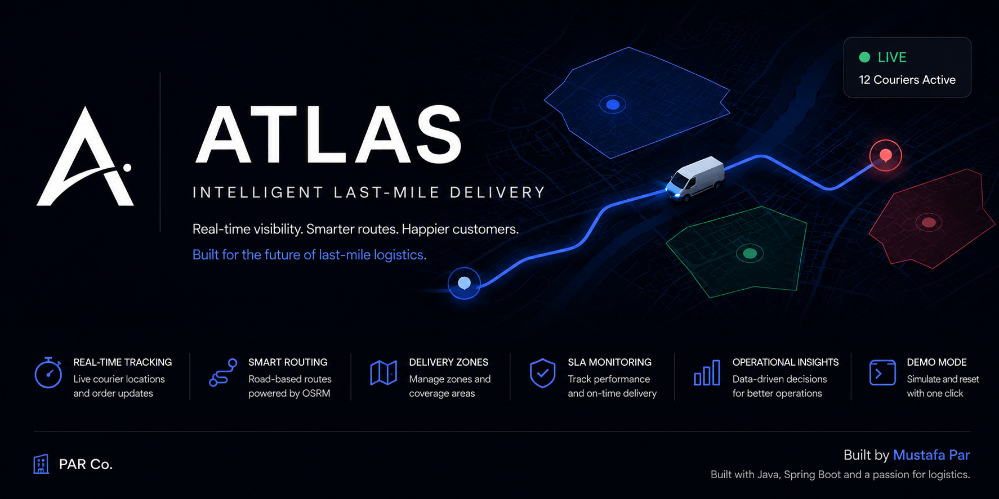
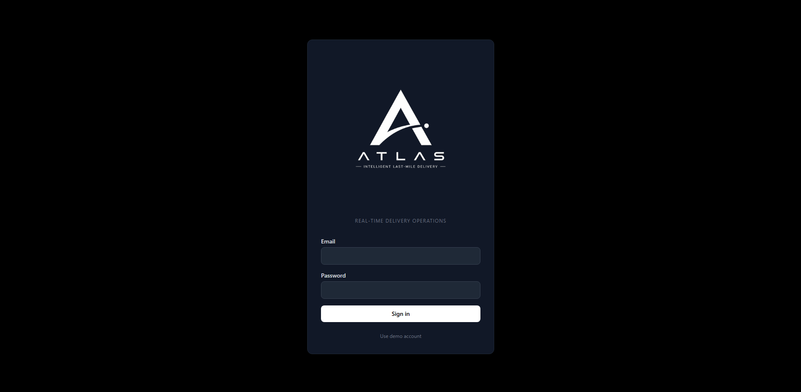
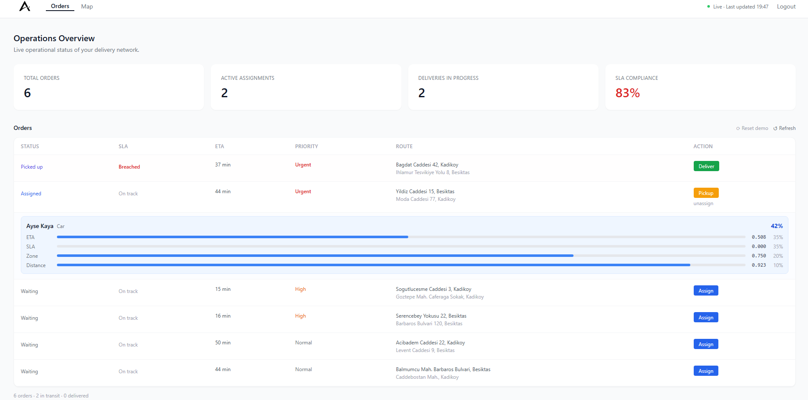
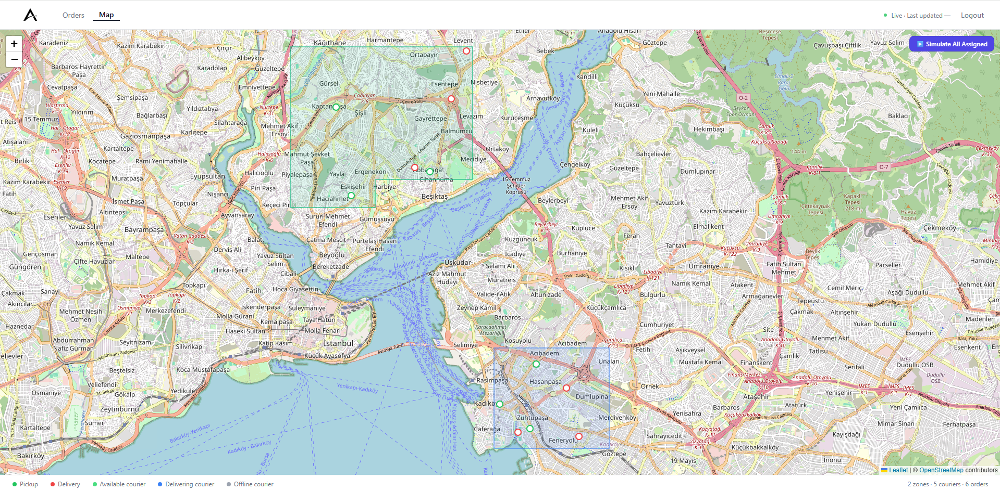
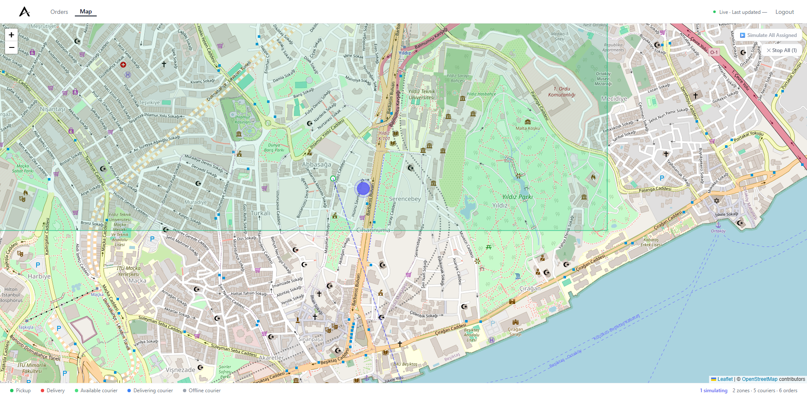

<p align="center">
  
</p>

<h1 align="center">ATLAS</h1>

<p align="center">
  <strong>Intelligent Last-Mile Delivery Platform</strong>
  <br/>
  Real-time courier tracking, smart routing and delivery operations dashboard.
</p>

<p align="center">
  
  
  
  
  
  
  
</p>

---

## 🚚 About

Atlas is a full-stack logistics platform built to simulate and manage last-mile delivery operations.

The platform provides:

- 🚚 Real-time courier tracking
- 🗺️ Road-based routing powered by OSRM
- 📦 Order assignment and delivery workflow
- 📍 Pickup & delivery confirmations
- 🎯 Delivery zone management
- 📊 SLA and ETA monitoring
- 👥 Multi-courier simulations
- 🔄 Demo reset functionality

---

# 🎥 Demo

<p align="center">
  
</p>

---

# ✨ Features

- Real-time courier tracking
- Road-based routing (OSRM)
- Delivery zone management
- Live courier simulation
- Multi-courier support
- SLA monitoring
- ETA tracking
- JWT authentication
- Dockerized PostgreSQL environment
- Demo mode with instant reset

---

# 📸 Screenshots

## Login

<p align="center">
  
</p>

---

## Operations Dashboard

<p align="center">
  
</p>

---

## Live Map

<p align="center">
  
</p>

---

## Courier Simulation

<p align="center">
  
</p>

---

# 🏗 Architecture

```text
React + TypeScript Dashboard
            │
            ▼
Spring Boot REST API
            │
            ▼
PostgreSQL Database
            │
            ▼
Docker
```

---

# 🛠 Tech Stack

### Backend
- Java 21
- Spring Boot 3
- Spring Security
- JWT Authentication
- JPA / Hibernate
- Flyway
- PostgreSQL
- Docker

### Frontend
- React
- TypeScript
- Vite
- Leaflet
- Axios

---

🚀 Getting Started
Prerequisites
• Java 21
• Maven 3.9+
• Node.js 20+
• Docker Desktop

Clone Repository
git clone https://github.com/MustafaPar/atlas.git
cd atlas

Start PostgreSQL
docker run --name atlas-postgres \
-e POSTGRES_DB=atlas \
-e POSTGRES_USER=atlas \
-e POSTGRES_PASSWORD=atlas \
-p 5432:5432 \
-d postgres:16

docker ps

Start Backend
cd atlas-api

Windows PowerShell
$env:JWT_SECRET="atlas-demo-secret-key-at-least-32-characters"
mvn spring-boot:run

Linux / macOS
export JWT_SECRET="atlas-demo-secret-key-at-least-32-characters"
mvn spring-boot:run

API:
http://localhost:8080

Start Frontend
cd atlas-dashboard
npm install
npm run dev

Dashboard:
http://localhost:5173 (default Vite port)

Demo Account
Email: demo@atlas.io
Password: demo12345

# 📁 Project Structure

```text
atlas-api/
├── auth/
├── courier/
├── delivery-zone/
├── order/
├── assignment/
├── simulation/
└── common/

atlas-dashboard/
├── auth/
├── api/
├── map/
├── orders/
└── components/
```

---

# 🔮 Roadmap

- [ ] WebSocket live updates
- [ ] Route optimization engine
- [ ] Notifications system
- [ ] Analytics dashboard
- [ ] Mobile courier application
- [ ] Kubernetes deployment

---

# 👨‍💻 Author

**Mustafa Par**

Computer Engineering Student @ Istinye University

GitHub: https://github.com/MustafaPar

---

<p align="center">
Built with Java, Spring Boot and a passion for logistics.
</p>
